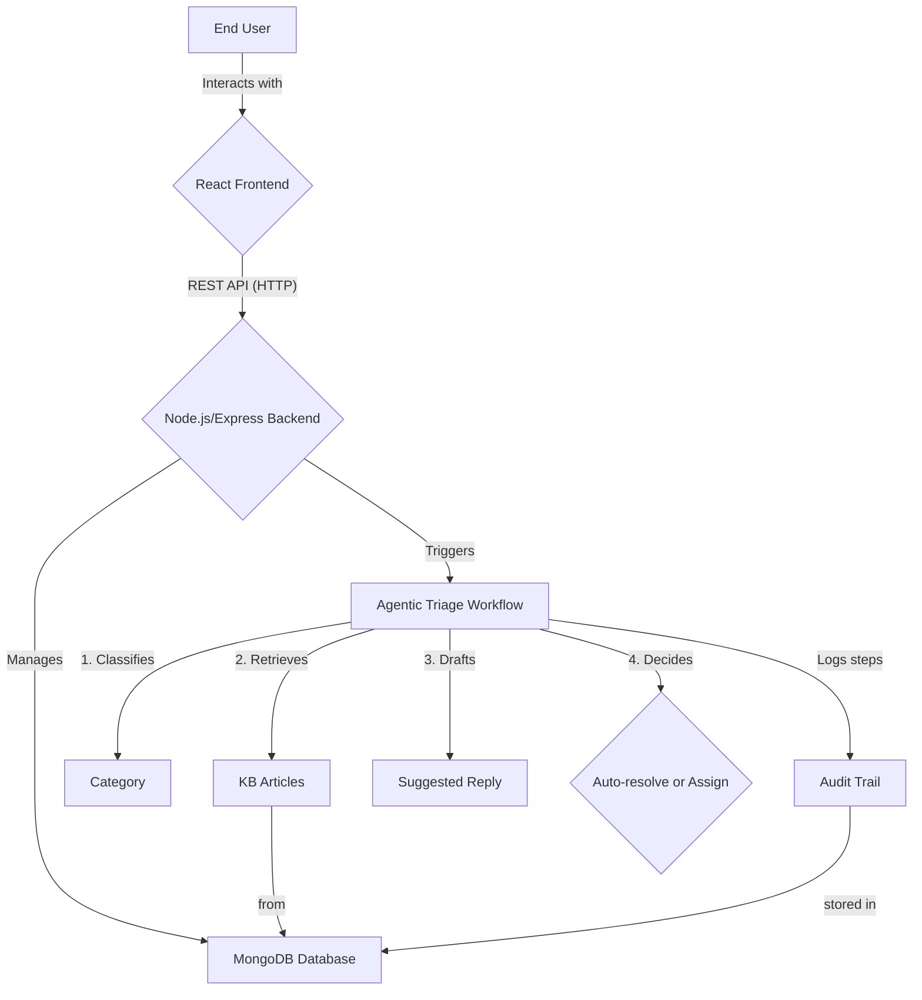

# Smart Helpdesk with Agentic Triage

This is an end-to-end web application where users can raise support tickets which are then triaged by an AI agent. The agent classifies the ticket, fetches relevant knowledge-base articles, drafts a reply, and either auto-resolves the ticket or assigns it to a human.

## Core Features

* **User Authentication:** Secure user registration and login with JWT.
* **Role-Based Access Control:** Distinct roles for End Users, Support Agents, and Admins.
* **Knowledge Base (KB) Management:** Admins can perform CRUD operations on KB articles.
* **Ticket Lifecycle:** Users can create and view tickets; agents can manage them.
* **Agentic Triage Workflow:** New tickets are automatically processed by a rule-based AI agent.
* **Detailed Audit Trail:** Every action on a ticket is logged and visible.

## Architecture

This project is a **MERN Stack** application containerized with Docker.

* **Frontend:** A **React** single-page application built with Vite. It handles the user interface and communicates with the backend via a REST API.
* **Backend:** A **Node.js** and **Express.js** server that provides the REST API, manages database interactions, and orchestrates the agentic workflow.
* **Database:** A **MongoDB** database running in a Docker container, managed by Mongoose.
* **Agent:** The agentic logic is implemented directly within the **Node.js** backend, following the "MERN-only" track of the assignment.

### Architecture Diagram (Mermaid)


## Getting Started

### Prerequisites

Ensure the following tools are installed on your system:

* Docker and Docker Compose
* Node.js (for local script execution)
* A web browser and an API client like Postman

### Setup and Run

Follow these steps to set up and run the application:

#### 1. Clone the Repository

```bash
git clone <your-repo-url>
cd smart-helpdesk


#### 2. Configure Environment Variables

The backend requires two environment files in the `server/` directory:

* **`.env`**: Used by the Docker container.
* **`.env.local`**: Used by the local seeder script.

Create `server/.env` with the following content:

```env
PORT=8080
MONGO_URI=mongodb://mongo:27017/helpdesk
JWT_SECRET=your-jwt-secret
AUTO_CLOSE_ENABLED=true
CONFIDENCE_THRESHOLD=0.78
```

Create `server/.env.local` with the following content:

```env
MONGO_URI=mongodb://localhost:27017/helpdesk
```

#### 3. Run the Application

From the root `smart-helpdesk` directory, run:

```bash
docker compose up --build
```

* The frontend will be available at: [http://localhost:5173](http://localhost:5173)
* The backend API will be available at: [http://localhost:8080](http://localhost:8080)

#### 4. Seed the Database

With the Docker containers running, open a new terminal and navigate to the `server/` directory. Run the seed script to populate the database with sample users and KB articles:

```bash
npm run seed
```

**Sample Users:**
* **Admin:** `admin@example.com` / `password123`
* **User:** `user@example.com` / `password123`

## How the Agent Works

The agentic triage workflow is a deterministic (rule-based) system designed to simulate an AI coworker. It is triggered automatically whenever a new ticket is created.

### Workflow Steps

1. **Plan:** The plan is hardcoded as a simple state machine inside the `agentController.js` file: `Classify -> Retrieve -> Draft -> Decide`.
2. **Classify:** The agent analyzes the ticket's title and description for specific keywords (e.g., "refund," "invoice," "charge" for billing). Based on these keywords, it assigns a category and a pseudo-confidence score.
3. **Retrieve KB:** Using the predicted category as a tag, the agent performs a keyword search against the Knowledge Base to find the top 3 most relevant published articles.
4. **Draft Reply:** It generates a templated reply that includes the titles of the retrieved KB articles, suggesting them as potential solutions.
5. **Decision:** The agent compares its confidence score to the `CONFIDENCE_THRESHOLD` from the environment variables:
   * If the score is greater than or equal to the threshold (and `AUTO_CLOSE_ENABLED` is `true`), the ticket status is set to `resolved`, and the action is logged.
   * Otherwise, the ticket status is set to `waiting_human`, and it is assigned for manual review.
6. **Logging:** Every step of this process is recorded in the `auditlogs` collection with a consistent `traceId` for the entire pipeline.

## Running Tests

To ensure the application works as expected, both the backend and frontend include automated test suites. Follow the steps below to execute these tests.

### Backend Tests
The backend tests verify the functionality of the REST API, database interactions, and the agentic triage workflow.

1. Navigate to the `server/` directory:
   ```bash
   cd server
   ```
2. Run the following command to execute the tests:
   ```bash
   npm test
   ```
3. The test results will be displayed in the terminal, including any failed tests.

### Frontend Tests
The frontend tests ensure the UI components, user interactions, and API integrations work as expected.

1. Navigate to the `client/` directory:
   ```bash
   cd client
   ```
2. Run the following command to execute the tests:
   ```bash
   npm test
   ```
3. The test results will be displayed in the terminal, including a summary of passed and failed tests.

### Additional Notes:
- Ensure the necessary dependencies are installed by running `npm install` in both `server/` and `client/` directories before running the tests.
- For detailed test coverage reports (if configured), check the output files or logs generated by the testing framework.vv

